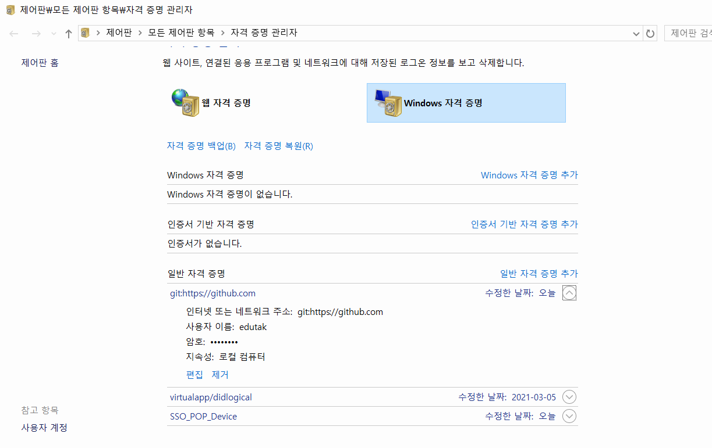

# git config - author

커밋을 남기는 사람에 대한 정보(이메일, 이름)을 설정함.

```bash
$ git config --global user.name '이름'
$ git config --global user.email '이메일주소'
$ git config --global -l
user.email=edutak.ssafy@gmail.com
user.name=edutak
```

* 위의 설정은 github 권한과는 상관이 없음

  * 다만, github 이메일주소와 동일하게 지정하면, 커밋 기록이 github 계정과 연동되어 표기 (예 - 잔디밭)

* github 인증 및 권한은 아래에서 관리됨

  * 윈도우 - 자격 증명 관리자

    

  * 맥 - 키체인 접근